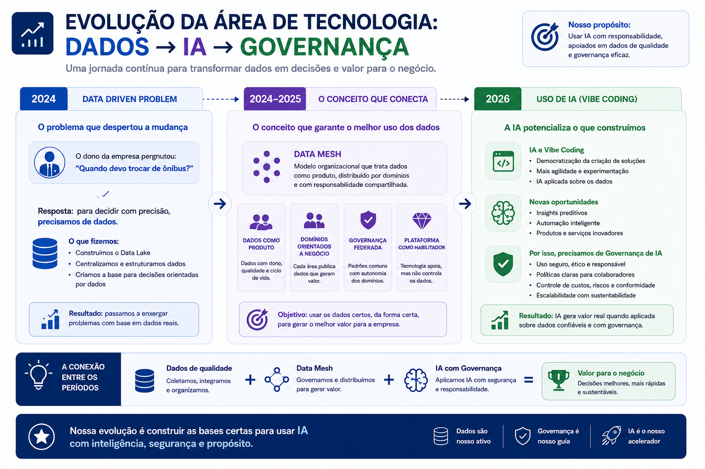
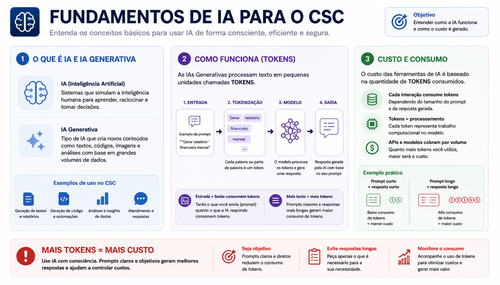

# Evolução Tecnológica

!!! abstract "Mensagem principal"
    Entre 2024 e 2026, tecnologia deixou de ser apenas suporte operacional e passou a sustentar dados, inteligência e automação.

<figure class="exec-figure exec-figure-wide">
  
  <figcaption>Da base data-driven ao uso de IA com governança.</figcaption>
</figure>

## Linha do tempo

| Fase | Movimento | Maturidade esperada |
| --- | --- | --- |
| 2024 | **data-driven problem** | Reconhecer a necessidade de dados integrados |
| 2024 | **datalake** | Centralizar e organizar informações |
| 2025 | Dados e automação | Melhorar processos e decisões |
| 2026 | **IA generativa** | Acelerar criação, análise e produtividade |
| 2026+ | **governança de IA** | Escalar IA com controle e segurança |

## Mudança de lógica

-   **Operacional**

    ---

    Sistemas, suporte, manutenção e resposta a demandas.

-   **Data-driven**

    ---

    Dados integrados, indicadores e decisões mais consistentes.

-   **Inteligência aplicada**

    ---

    IA, automação, copilotos e soluções assistidas por modelos generativos.

## O acelerador de 2026

!!! info "IA generativa"
    Ferramentas generativas permitem criar textos, análises, códigos, automações e protótipos em ciclos muito mais curtos.

<figure class="exec-figure">
  
  <figcaption>Fundamentos de IA para uso consciente, eficiente e seguro.</figcaption>
</figure>

## O alerta

!!! danger "Vibe coding sem controle"
    Vibe coding pode acelerar soluções, mas também criar código sem revisão, dependências desconhecidas e baixa documentação.

## Decisão estratégica

| Se a empresa apenas libera | Se a empresa governa |
| --- | --- |
| Velocidade local | Escala corporativa |
| Soluções isoladas | Reuso e padronização |
| Risco pouco visível | Segurança e rastreabilidade |

> A evolução tecnológica só vira vantagem sustentável quando é acompanhada por governança.
