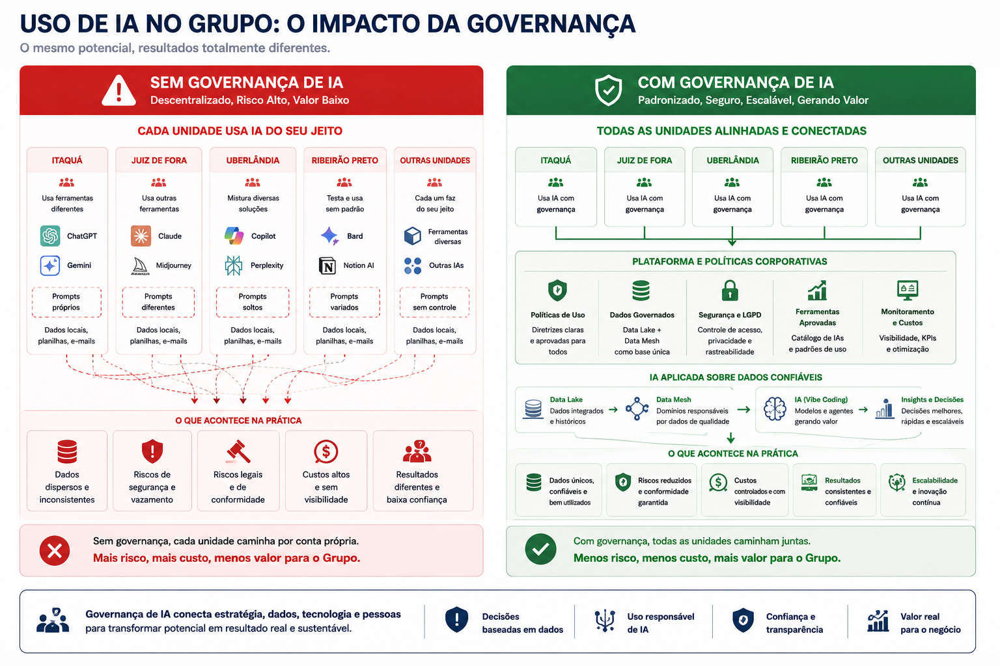
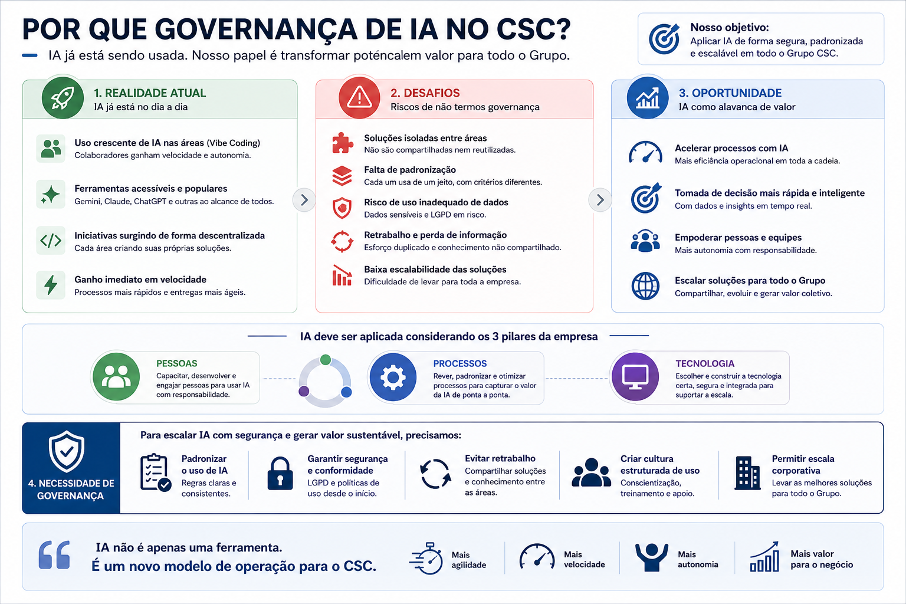

# Com Governança

!!! success "Mensagem principal"
    Governança de IA cria condições para inovar com segurança, padronização, rastreabilidade e alinhamento estratégico.

<figure class="exec-figure exec-figure-wide">
  
  <figcaption>O mesmo potencial de IA produz resultados diferentes conforme o modelo de governança.</figcaption>
</figure>

## O modelo desejado

-   **Padrões**

    ---

    Regras claras para ferramentas, dados, código e validação.

-   **Segurança**

    ---

    Proteção de dados, controle de acesso e revisão proporcional ao risco.

-   **Reuso**

    ---

    Soluções compartilhadas, documentadas e escaláveis.

-   **Inovação controlada**

    ---

    Experimentação com limites, responsáveis e critérios de aprovação.

## Comparativo executivo

| Dimensão | Sem governança | Com governança |
| --- | --- | --- |
| Ferramentas | Escolhas individuais | Catálogo aprovado |
| Dados | Uso informal | Regras por sensibilidade |
| Vibe coding | Criação rápida sem padrão | Revisão, documentação e controle |
| IA generativa | Uso disperso | Diretrizes e rastreabilidade |
| Risco | Pouco visível | Classificado e tratado |
| Escala | Difícil reutilizar | Soluções padronizadas |

## Controles essenciais

!!! info "Governança mínima viável"
    Começar com controles simples: registro de casos de uso, classificação de risco, ferramentas aprovadas e revisão humana para usos críticos.

<figure class="exec-figure">
  
  <figcaption>Governança transforma uso disperso de IA em capacidade corporativa.</figcaption>
</figure>

## Benefícios

| Benefício | Resultado |
| --- | --- |
| Padronização | Menos duplicidade e mais consistência |
| Segurança | Menor exposição de dados e ativos |
| Rastreabilidade | Decisões auditáveis |
| Alinhamento | IA conectada à estratégia |
| Reuso | Ganho de escala entre unidades |

## Mensagem final

> Governança não reduz inovação. Governança transforma inovação dispersa em capacidade corporativa.
