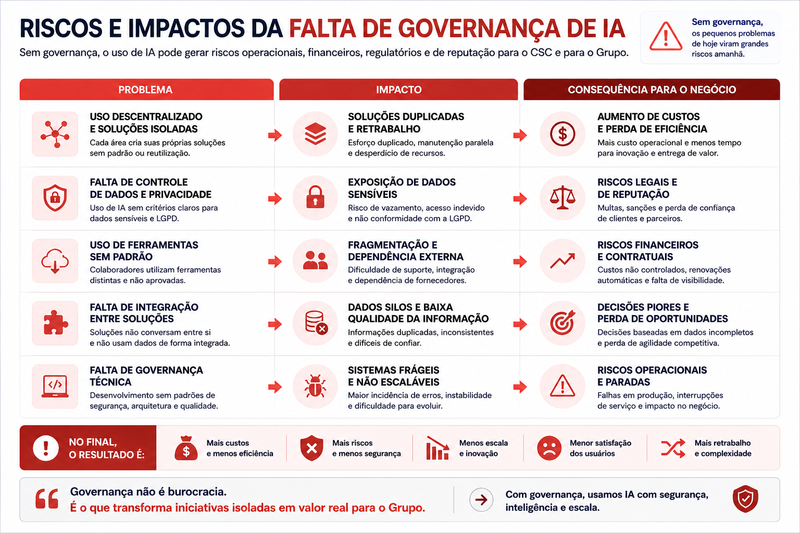
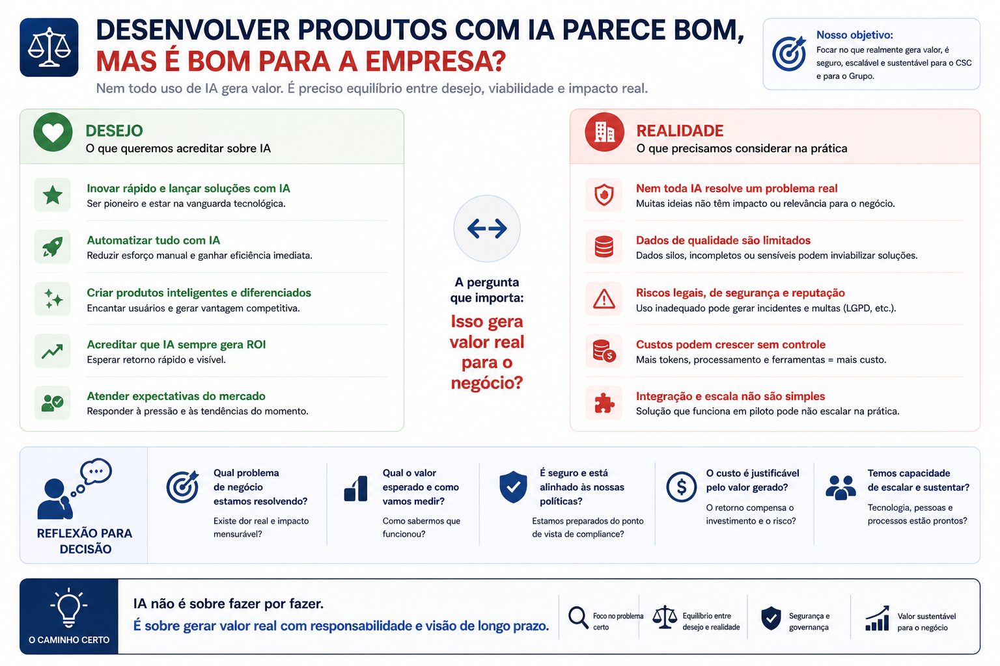

# Sem Governança

!!! danger "Mensagem principal"
    IA sem governança gera produtividade aparente, mas aumenta risco, fragmentação e perda de controle institucional.

<figure class="exec-figure exec-figure-wide">
  
  <figcaption>Riscos operacionais, financeiros, regulatórios e reputacionais do uso de IA sem governança.</figcaption>
</figure>

## Como o cenário aparece

-   **Unidades isoladas**

    ---

    Cada área escolhe ferramentas, prompts e automações por conta própria.

-   **Soluções duplicadas**

    ---

    Problemas semelhantes são resolvidos várias vezes, com custos e padrões diferentes.

-   **Risco invisível**

    ---

    A empresa não sabe quais dados, modelos e decisões estão envolvidos.

## Matriz de risco

| Risco | Efeito executivo |
| --- | --- |
| Fragmentação | Baixa capacidade de escalar soluções |
| Duplicidade | Desperdício de tempo e orçamento |
| Falta de controle | Dificuldade de auditoria |
| Dados sensíveis expostos | Risco jurídico, reputacional e operacional |
| Código gerado sem revisão | Falhas de segurança e manutenção |
| Decisões sem rastreabilidade | Baixa confiança nos resultados |

## Exemplo típico

!!! example "Crescimento espontâneo"
    Uma unidade usa IA generativa para documentos. Outra cria automações. Outra desenvolve aplicações com vibe coding. Todas ganham velocidade, mas nenhuma segue o mesmo padrão.

<figure class="exec-figure">
  
  <figcaption>Nem todo uso de IA gera valor real para o negócio.</figcaption>
</figure>

## O problema central

| Pergunta | Sem governança |
| --- | --- |
| Quem aprovou? | Não está claro |
| Quais dados foram usados? | Não está documentado |
| Quem valida o resultado? | Depende da unidade |
| A solução pode ser reutilizada? | Normalmente não |
| Existe padrão de segurança? | Não necessariamente |

!!! quote "Síntese"
    Sem governança, a IA vira um conjunto de iniciativas locais. Algumas úteis, outras arriscadas, quase todas difíceis de escalar.
